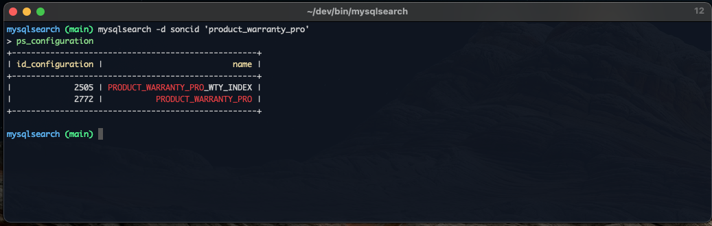

# Description

This program will allow you to search for text in the entire mysql database.


# Instalation
```sh 
https://github.com/gkssjovi/mysqlsearch.git
cd mysqlsearch

chmod +x install.sh && ./install.sh
```

# Usage 
```sh
mysqlsearch
mysqlsearch -d <database_name> 'query'
mysqlsearch -u root -p '' -d <database_name> 'query'
mysqlsearch -u root -p '' -d <database_name> -f full 'query'
mysqlsearch -u root -p '' -d <database_name> -t <table_name> 'query'
```



# Help
`mysqlsearch --help`

```
mysqlsearch [command]

Commands:
  mysqlsearch <query>  Search query in database

Options:
      --help                Show help                                  [boolean]
      --version             Show version number                        [boolean]
  -h, --host                Hostname                                    [string]
  -d, --database            Database                                    [string]
  -P, --port                Port                                        [number]
  -u, --user                User                                        [string]
  -p, --password            Password                                    [string]
  -r, --format-row          Display row formats <less, default, full>   [string]
  -c, --format-cell         Display cell formats <full, match, match-one>
                                                                        [string]
      --trim-match-context  Trim the match context.                    [boolean]
  -s, --theme               Display with different style <solid, default,
                            dashed>                                     [string]
  -t, --table               Search only in a specific table             [string]
  -l, --limit               Limit the search results                    [number]
      --exit                Execute the script only once and then exit [boolean]
```
